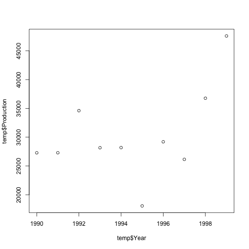
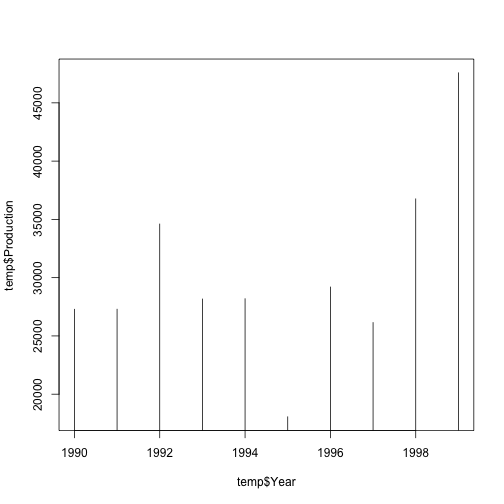
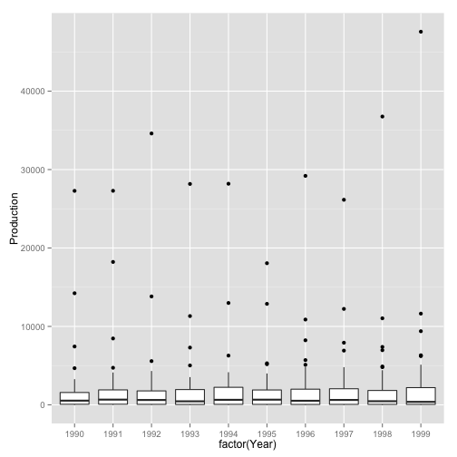
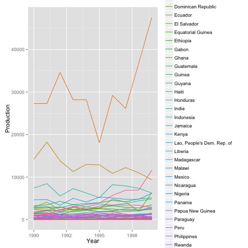
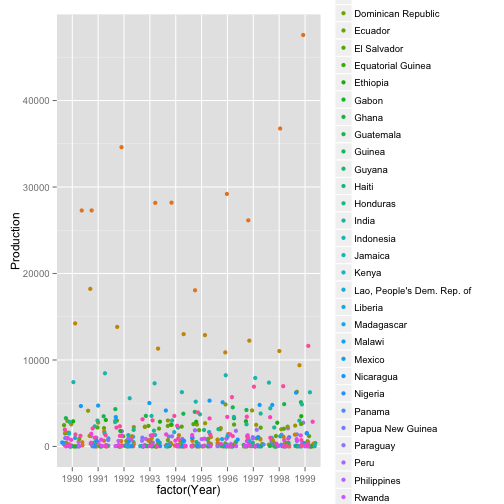
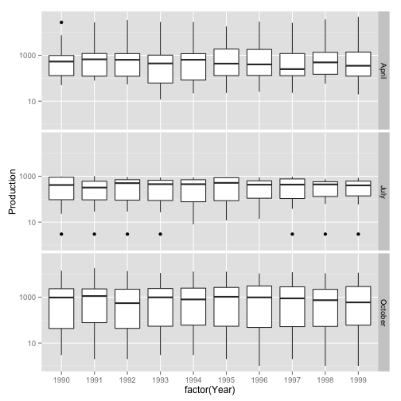

Data munching and plotting using plyr/data.table and ggplot2
==============================================================


Processing the data is one of the most exhausting tasks in data analysis. Various people tell different proportions, but all of them agree on one thing: if you stay in profession that deals with data analysis, you will spend most of the time preprocessing your data and analysing them in *descriptive statistics* way.

Then comes the relatively easy part. You run three to five commands that fit the model and give you results. You look at them and hopefully you like them and want to move on.

The last part is presenting the content. The things that you have done up till now do not matter unless you can sell your findings, make them matter. This is, at least in academic circles, done by two things: figures and tables. THIS is the very important part of your research. You can have briliant results, but if you don't present them nice, they are useless. In a way it is often very annoying and challenging task.

*Personal story: I once had done analysis on several assets, using various models and needed to plot $R^2$ like measure so that one could compare them, and the picture would not be pure mess. I had about 700 lines in the data set. After several days of thinking I came up with a way how to fit them in ONE figure and this one figure became the most important part of my work.*

Learning these skill is generally not fun and you can probably pass the course without them. But if you will do some reasonably empirical work or write empirical thesis, you will be glad you learnt them.

Introduction
---------------------------------

This short tutorial is supposed to primarily show you, what is possible. It is not that important that you remember every single detail and nobody will examine you on this. It is important that you know what types of figures exist and that you don't have to do many tasks repetitively, that there is a code for it already. You can always find the particular expression through Google. This html is freely available for your use anytime.

Note: installing is done as you saw on the ES using command `install.packages("name of package")`.

Introductory data munching
---------------------------------

We will be only concerned with tabular data. Tabular data roughly mean that you would have one sheet in Excel, where in first row you would have names of the variables and in the subsequent rows values of the entries. (Stata has exactly this representation of the data. R contains many more data structures but from basic point of view this is your bread and butter.) In R this data structure is called a `data.frame`. For our purposes, as I love coffee, I downloaded and gently edited some data about coffee production around the world. (Source: webpages of International Coffee Organization. http://www.ico.org/new_historical.asp the data are mess even in csv format so I edited some parts to make it a bit meaningful.) Let's load the data and look what structure they have.


```r
data <- read.csv("/Users/tomaskrehlik/Documents/PHD/Advanced Econometrics/Seminars/0 - Introduction to R/Data manipulation and plotting/TOTPRODUCTION.csv", 
    header = T)  # header=T -> first row are names of variables
str(data)
```

```
## 'data.frame':	54 obs. of  12 variables:
##  $ Country : Factor w/ 54 levels "Angola","Benin",..: 1 3 4 5 15 27 32 33 38 39 ...
##  $ X1990.91: int  50 123 27286 487 1504 7441 982 105 963 131 ...
##  $ X1991.92: int  79 107 27293 667 2124 8463 933 124 747 80 ...
##  $ X1992.93: int  78 123 34603 620 1185 5577 1122 137 900 54 ...
##  $ X1993.94: int  33 57 28167 393 2069 7301 442 62 1019 70 ...
##  $ X1994.95: int  77 122 28192 664 2376 6280 641 84 1139 25 ...
##  $ X1995.96: int  62 152 18060 434 1888 5180 785 91 1002 23 ...
##  $ X1996.97: int  71 133 29197 401 1993 8235 849 49 1089 26 ...
##  $ X1997.98: int  64 153 26148 250 1191 7922 624 61 1074 23 ...
##  $ X1998.99: int  85 150 36761 492 1206 7385 992 64 1352 58 ...
##  $ X1999.00: int  55 184 47578 351 1198 6264 427 59 1387 20 ...
##  $ Group   : Factor w/ 3 levels "April","July",..: 1 1 1 1 1 1 1 1 1 1 ...
```


Ok, looks nice, no obvious errors. You can see from the `str` output that `data.frame` was already made for you. Moreover, you can see types of columns. `Country` and `Group` are factors which means basically dummy variable (yet here they dont only have values 0 and 1 but from 0 to number of the countries and number of the groups). If you run regressions on these, they would usually behave as dummy variables. The other columns seem to be years and respective number is total production in the given season. Int here means that the variable is integer, hence a number without decimal.

Now, let's look at one entry where country is Yemen. So, we need to somehow select one row which has country column equal to Yemen. (Of course, you can just press the icon on the right next to `data` entry in Environment pane and you can browse the data, but finding things in `data.frame` can be very useful if you have 1000 lines.)

So, we need to somehow access the column. In R `data.frame`s it is done this way:

```r
data$Country
```

```
##  [1] Angola                     Bolivia                   
##  [3] Brazil                     Burundi                   
##  [5] Ecuador                    Indonesia                 
##  [7] Madagascar                 Malawi                    
##  [9] Papua New Guinea           Paraguay                  
## [11] Peru                       Rwanda                    
## [13] Zimbabwe                   Congo, Rep. of            
## [15] Cuba                       Dominican Republic        
## [17] Haiti                      Philippines               
## [19] Tanzania                   Zambia                    
## [21] Benin                      Cameroon                  
## [23] Central African Republic   Colombia                  
## [25] Congo Dem.Rep.of           Costa Rica                
## [27] Cote dIvoire               El Salvador               
## [29] Equatorial Guinea          Ethiopia                  
## [31] Gabon                      Ghana                     
## [33] Guatemala                  Guinea                    
## [35] Guyana                     Honduras                  
## [37] India                      Jamaica                   
## [39] Kenya                      Lao, People's Dem. Rep. of
## [41] Liberia                    Mexico                    
## [43] Nicaragua                  Nigeria                   
## [45] Panama                     Sierra Leone              
## [47] Sri Lanka                  Thailand                  
## [49] Togo                       Trinidad & Tobago         
## [51] Uganda                     Venezuela, Bol. Rep. of   
## [53] Vietnam                    Yemen                     
## 54 Levels: Angola Benin Bolivia Brazil Burundi ... Zimbabwe
```

(It is very advisable to have your columns named reasonably, without spaces and punctuation and diacritics, because computers generaly dont like them. So column name `zapsany_predmet` is fine but `zapsaný předmět` is not! Names of columns of the `data.frame` can be accessed by calling function `names(name_of_dataframe)`, i.e. `names(data)` in our case. Try it!)

Ok, now we make it equal to `Yemen`.

```r
data$Country == Yemen
```

```
## Error: object 'Yemen' not found
```

Ops, does not work. Why? Because captions or strings must ALWAYS be in the quotes! (here it would be some object in R, try doing `country_select <- "Yemen"` and then running `data$Country == country_select`) Okay, let's do it again:

```r
data$Country == "Yemen"
```

```
##  [1] FALSE FALSE FALSE FALSE FALSE FALSE FALSE FALSE FALSE FALSE FALSE
## [12] FALSE FALSE FALSE FALSE FALSE FALSE FALSE FALSE FALSE FALSE FALSE
## [23] FALSE FALSE FALSE FALSE FALSE FALSE FALSE FALSE FALSE FALSE FALSE
## [34] FALSE FALSE FALSE FALSE FALSE FALSE FALSE FALSE FALSE FALSE FALSE
## [45] FALSE FALSE FALSE FALSE FALSE FALSE FALSE FALSE FALSE  TRUE
```

So now we have a vector of TRUE and FALSE values having TRUE on the position, where it was evaluated TRUE. 

So accessing the row with Country equal to Yemen can be done this way

```r
data[data$Country == "Yemen", ]
```

```
##    Country X1990.91 X1991.92 X1992.93 X1993.94 X1994.95 X1995.96 X1996.97
## 54   Yemen       NA       NA       NA       NA       NA       NA       NA
##    X1997.98 X1998.99 X1999.00   Group
## 54       NA       69       61 October
```

(data works also as a matrix and you told R wchich rows are TRUE -> selected. You did not specify which columns to selec, so it prints all. Try to play with this.)

That was one way of doing this. Second, less educative on how things work, but more intuitive is using a function which in its definition works exactly as I have showed now.

```r
subset(data, Country == "Yemen")
```

```
##    Country X1990.91 X1991.92 X1992.93 X1993.94 X1994.95 X1995.96 X1996.97
## 54   Yemen       NA       NA       NA       NA       NA       NA       NA
##    X1997.98 X1998.99 X1999.00   Group
## 54       NA       69       61 October
```


Why is Yemen so interesting? No, no coffee trivia, yet. The `NA` thing is interesting. This is how R shows that there is a missing observation. Thing about what attributes should `NA` have? What happens if you sum a number and `NA` what if you multiply by it? What if you try to select a minimum? Etc?

Play with `subset` function, look for values that are in October group, that have higher production in a given year! Become confident user of this function.

OK, cool, we know how to select observations. Let's get down to something more interesting. This table has a strange format, doesnt it? The time is itself a variable, isn't it? So what does it do in the names? Shouldn't the real `data.frame` have names that are `Country Year Production Group`? Sure it should. How would you now subset countries that had production higher than x in years later then 1996?! There is a slaving way how to do that but you don't use R to make you work more, but work less! There is function exactly for what we want to do!!! It is called `melt` and it is in package `reshape`


```r
library(reshape)
```

```
## Loading required package: plyr
## 
## Attaching package: 'reshape'
## 
## The following object is masked from 'package:plyr':
## 
## rename, round_any
```

```r
data_melted <- melt(data, id.vars = c("Country", "Group"), variable_name = "Year")
head(data_melted)
```

```
##     Country Group     Year value
## 1    Angola April X1990.91    50
## 2   Bolivia April X1990.91   123
## 3    Brazil April X1990.91 27286
## 4   Burundi April X1990.91   487
## 5   Ecuador April X1990.91  1504
## 6 Indonesia April X1990.91  7441
```

```r
names(data_melted) <- c("Country", "Group", "Year", "Production")
head(data_melted)
```

```
##     Country Group     Year Production
## 1    Angola April X1990.91         50
## 2   Bolivia April X1990.91        123
## 3    Brazil April X1990.91      27286
## 4   Burundi April X1990.91        487
## 5   Ecuador April X1990.91       1504
## 6 Indonesia April X1990.91       7441
```

Now the years are not exactly integers, are they. To make them integers, that is a bit more complex, if you don't want to bother, just carry on. If you do, the code should be clear enough. (This is particularly nasty task for R, yet would be almost impossible in other languages. Execute the code step-by-step if you need.)

```r
strings <- as.character(data_melted$Year)  # Convert the factors to strings
# Now note that the strings have particular structure, we dont need anything
# behind the '.' so I split the string by it
list1 <- strsplit(strings, "\\.")  # The result is list with first entry that intrest us and the rest that does not
# Lets first make it an array. (This code is esotheric, but usefull for
# converting lists to arrays.)
list1 <- do.call(rbind, list1)  # It essentially calls rbind function over the list
list1 <- list1[, 1]  # Select only first part
# Again we can split by 'X'
list2 <- strsplit(list1, "X")
list2 <- do.call(rbind, list2)
list2 <- list2[, 2]
year <- as.integer(list2)
data_melted$Year <- year  # R is case sensitive!!!!
head(data_melted)
```

```
##     Country Group Year Production
## 1    Angola April 1990         50
## 2   Bolivia April 1990        123
## 3    Brazil April 1990      27286
## 4   Burundi April 1990        487
## 5   Ecuador April 1990       1504
## 6 Indonesia April 1990       7441
```

That's how we should like the data. Now some more useful stuff things. What if we wanted generate means by Groups and Years? That would be a looooooot of subsetting if you would do it by hand! Yet again somebody thought of that before and there is a function for that. It is extremely useful and is called `ddply` from package `plyr`. (There are other variants of that function, check it in the documentation if you are interested.) Let's play with it a bit.

```r
library(plyr)
ddply(data_melted, .(Year, Group), summarize, mean = mean(Production, na.rm = T))
```

```
##    Year   Group   mean
## 1  1990   April 3138.2
## 2  1990    July  517.0
## 3  1990 October 1575.4
## 4  1991   April 3269.4
## 5  1991    July  418.0
## 6  1991 October 1810.8
## 7  1992   April 3606.0
## 8  1992    July  451.4
## 9  1992 October 1527.5
## 10 1993   April 3133.4
## 11 1993    July  425.6
## 12 1993 October 1557.5
## 13 1994   April 3146.7
## 14 1994    July  435.6
## 15 1994 October 1610.5
## 16 1995   April 2308.3
## 17 1995    July  495.7
## 18 1995 October 1725.9
## 19 1996   April 3408.9
## 20 1996    July  430.6
## 21 1996 October 1800.3
## 22 1997   April 3058.7
## 23 1997    July  467.6
## 24 1997 October 1827.7
## 25 1998   April 3924.5
## 26 1998    July  383.9
## 27 1998 October 1601.1
## 28 1999   April 4669.2
## 29 1999    July  408.6
## 30 1999 October 1954.4
```

Look to `?ddply` at examples how to use this function. It is possible to apply arbitrary function over the subset vector. What does the function do is: It selects unique combinations for Year and Group, it then subsets by every combination and the result of subsetting is production vector and over this vector you can do whatever you want, here we did mean. I will do some non-sensful thing in here. Let's define some arbitrary function and see that it works

```r
bla_function <- function(vector) {
    return(max(vector, na.rm = T)%%100)  # Do the reminder of division by 100 from max value
}
ddply(data_melted, .(Year, Group), summarize, aa = bla_function(Production))
```

```
##    Year   Group aa
## 1  1990   April 86
## 2  1990    July 74
## 3  1990 October 31
## 4  1991   April 93
## 5  1991    July 18
## 6  1991 October 22
## 7  1992   April  3
## 8  1992    July 20
## 9  1992 October 23
## 10 1993   April 67
## 11 1993    July 75
## 12 1993 October 20
## 13 1994   April 92
## 14 1994    July 77
## 15 1994 October 89
## 16 1995   April 60
## 17 1995    July 97
## 18 1995 October 78
## 19 1996   April 97
## 20 1996    July 90
## 21 1996 October 76
## 22 1997   April 48
## 23 1997    July 41
## 24 1997 October 33
## 25 1998   April 61
## 26 1998    July 39
## 27 1998 October 35
## 28 1999   April 78
## 29 1999    July 42
## 30 1999 October 31
```


Right now, if you can apply those functions with confidence, you are almost an average user of R. Probably the biggest takeaway from this part is that you should be lazy! If there is repetitive task to be done over data, somebody probably already thought of that. Another one, think about your data! What form should you have them in?

What functions should you know very well for restructuring data?
`subset, data.frame, ddply, melt, names, str`
This is empiricists bread and butter! Really!

Introductory plotting
------------------------

So now that we have data that we can actually work with and we know how to make ineresting observations, let's do some plotting. First, there are several packages that do plotting. There is the base one, that does not need any package. I personally use that one for quick look plots. They are fine to see what is happening, nothing fancy. So let me show you that one:


```r
temp <- subset(data_melted, Country == "Brazil")
plot(temp$Year, temp$Production, type = "p")
```

 

```r
plot(temp$Year, temp$Production, type = "l")
```

 

```r
plot(temp$Year, temp$Production, type = "h")
```

 


And then there is `ggplot2` package. If you will use it, I recommend very nice documentation with examples at page (http://docs.ggplot2.org/current/). It can create any reasonable pictures you can think of. Let's start simple.


```r
library(ggplot2)
plot <- ggplot(aes(x = Year, y = mean), data = ddply(data_melted, .(Year), summarize, 
    mean = mean(Production, na.rm = T)))
plot + geom_point()
```

 

Ok, so what if we wanted to know rather some statistical description of the Production than only mean?

```r
plot <- ggplot(aes(x = factor(Year), y = Production), data = data_melted)
plot + geom_boxplot()
```

```
## Warning: Removed 24 rows containing non-finite values (stat_boxplot).
```

 

Hmm, this picture shows that there are probably some big players. Why not to show the Country in colour.

```r
plot <- ggplot(data_melted, aes(Year, Production))
plot + geom_point(aes(colour = Country))
```

```
## Warning: Removed 24 rows containing missing values (geom_point).
```

 

```r
plot <- ggplot(data_melted, aes(Year, Production))
plot + geom_line(aes(colour = Country))
```

```
## Warning: Removed 24 rows containing missing values (geom_path).
```

 

And now what about plot, that knows that we have only one measurement in a year so it wont be any harm if he moves the point a bit left or right from x axis of the year so that we could see better.

```r
plot <- ggplot(aes(x = factor(Year), y = Production), data = data_melted)
plot + geom_jitter(aes(colour = Country))
```

```
## Warning: Removed 24 rows containing missing values (geom_point).
```

 

And now just a bit about faceting. What I have shown up till now can show about 3 dimensions. There are clever ways to put more of them in one picture, one of them is faceting.

```r
plot <- ggplot(aes(x = factor(Year), y = Production), data = data_melted)
plot + facet_grid(Group ~ .) + geom_boxplot() + scale_y_log10()
```

```
## Warning: Removed 35 rows containing non-finite values (stat_boxplot).
```

 

There are more packages for plotting in R but I personally think if you learn `ggplot2` and basic plotting functions above, I believe you have mastered the best there is. (If somebody would like interactive graphics, there is new hype package called `rCharts`, http://rcharts.io based on JavaScript and D3 library.)
