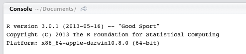
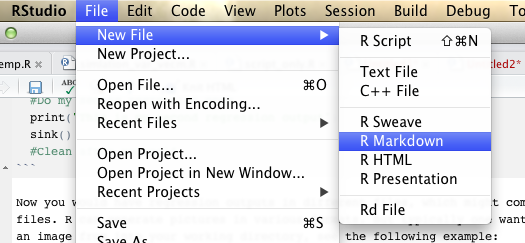

Generating reports and output with R and RStudio
========================================================

In your homework you will need to create and present some output from R. R is very versatile with creating outputs. As with many things in R, there are simple and more elaborate techniques how to create output. The elaborate technique needs more time-investment to learn, but is in the end more versatile! There are two typical scenarios:

- You have more "talkative" set-up and you will probably have only one/two graphs and very little of output in the solution. Then use simple techniques, don't waste your time doing more elaborate things.
- You have a fully empirical set-up and it seems that you will have to print out a lot of output. Then you really want to consider using R to generate the whole output.

Simple ways
-------------

There are several useful commands in R to deal with outputting. There are two cases of output. First is the output from console and second are pictures. You can always hit Export button in the Plots pane when you have made the plot to save it in a desired format and place or use Ctrl-C, Ctrl-V to copy the output from the console. But it is not recommended because once you change something small, all the output might change and you might need to do everything once again.

Before starting about commands, be sure that you set your working directory to a folder you want to work in. You can do that in two ways. First, the interactive one is to go to Files pane then navigate to a place you want to set as your working directory and select More -> Set As Working Directory from the drop down menu in there. The second way is to use `setwd()` function which takes as an argument a folder location. (To see how you should do it, first do it the intuitive way and you will see `setwd(...)` command evaluated in your Console.) Your Working Directory is shown in the head of Console pane, as you can see on the picture here:



To output to text file the console you need to add `sink()` function to your code. Here is an example:

```{r, eval=FALSE}
  sink("my_output.txt")
  print("Hey, this is my output")
  print(rnorm(100))
  sink()
```

This code creates a file `my_output.txt` in your working folder and prints there as you would expect. Running `sink()` redirects the rest of the output back to console. So that means that you can output different parts of your output to different files and some of them might not be in the output at all. Let's see a theoretical example, where you have two exercises and you want to have just the regression outputs in two separate files:

```{r, eval=FALSE}
  # Do some things that will print only to console
  sink("regression_out1.txt")
  #Do my regression code
  print("This is my first regression output")
  sink()
  # Do some things before the second output
  sink("regression_out2.txt")
  #Do my second regression code
  print("This is my second regression output")
  sink()
  #Clean after yourself
```

Now you would have regression outputs in different files, which might come useful, sometimes. Then you might also want to plot some some pictures in different files. R can generate pictures in various formats. But typically one wants them to be either `pdf` of `png` depending on where you are putting them. To generate an image from into your working directory, see the following example:

```{r, eval=FALSE}
  pdf("my_picture.pdf", height=10, width=10) #If you want png, just change the pdf for png everywhere
  plot(SOMETHING) # Of you might as well use the same code that creates plots from ggplot2
  dev.off() # The next pictures will plotted in RStudio
```

That is the easy way.

Elaborate outputting
-------------------------

As a proof to you, all these materials are done by the tool that I will describe in here. In many ways, when I am creating a document I find this way much easier because I already got used to it. Once you master it, the creation comes very naturally. So what are you using?

In R there is a very powerful tool named `knitr`. You install it as a normal package and moreover it should come embedded with RStudio. Then there are two input/output ways. Either you want to create a html file, as I am doing, or you might want to make a pdf. I will be demonstrating the html way, because it is more intuitive and easier. For pdf it is very much the same, only you must know a bit of LaTeX to start with.

To create a report in html in the same style as you see, you want to open new markdown file in RStudio as following picture suggests.



Then you should get a example file. Save it as some file as you will. Then hit the `Knit HTML` and see magic happen. As you can see, the chunks were run in the R and the output and code were added to the html, if the output was a figure, it was added as well. I might describe more in detail the process, but not to repeat what has already been written, go to [official short manual](http://www.rstudio.com/ide/docs/authoring/using_markdown?version=0.98.309&mode=desktop).

If you have ever created any wiki text you will immediately recognize most of the syntax, because that is precisely what wiki uses. Moreover, it is nothing mind-blowing, most of the syntax is actually quite natural. For more examples, you can see source files for these handouts. As an example, I am posting the source file for handout of seminar 1.