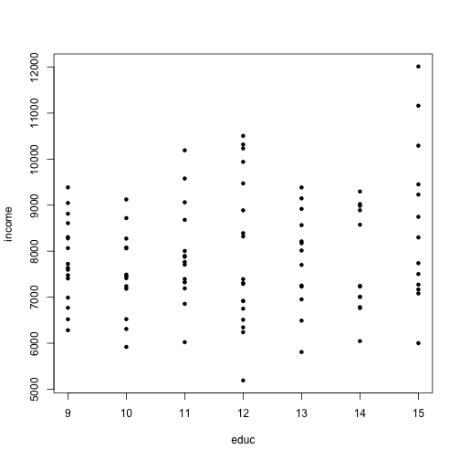
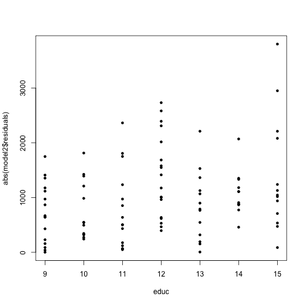
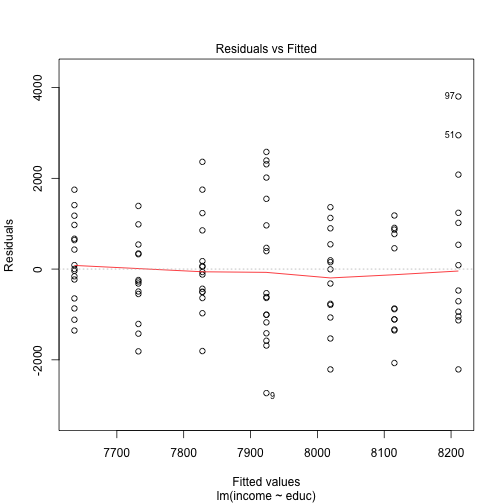
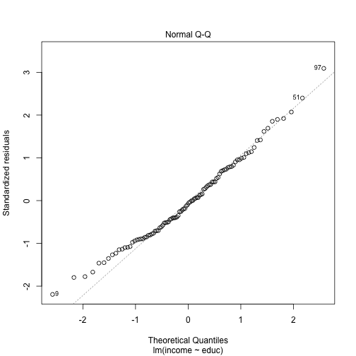
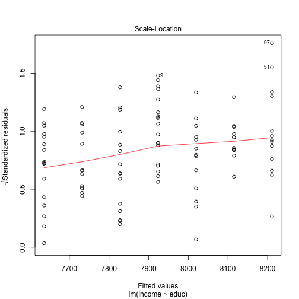
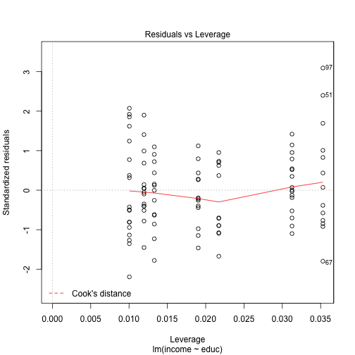

Deeper to OLS and quantile regression
========================================

Outliers and OLS
--------------------

Look into separate script for that, interactive one! Even one observation can change substantially the regression line if the standard error of errors is high. Even though the model explains some reasonable amount of the variance we might get insignificant coefficients! And this is with simulated data! Real world is bigger mess! One has to be very careful! How to get around it? Use iterrated weighted least squares with disproportional importance of outlying observations. Good source with example implementation in R is [here](http://www.ats.ucla.edu/stat/r/dae/rreg.htm).

Heteroscedasticity
---------------------

Previously in the experimental data, we generated the error term as a normal variable with standard deviation constant. Heteroscedasticity means that it ceises to be a constant and becomes somehow variable. There are many possible types of heteroscedasticity. Let's try to generate some of them and see how plots of heteroscedasticity of these types look like at the pictures.

First let's see heteroscedasticity that is dependent on one of the variables. I will apply simpler data generating process in here.

```r
educ_range <- 9:15  # Let's say we want education from 9:15
educ <- sample(educ_range, 100, replace = T)
epsilon <- rnorm(100, sd = 100)  # Generate 3000 normally distributed variables with sd=200
income <- 7000 + 100 * educ + educ * epsilon  # Set up some theoretical model
plot(educ, income, pch = 20)
```

 

The danger in here is that heteroscedasticity is not easily detected from the picture, even though it is very pronounced. Let us see the regression output and the plotted residuals

```r
model2 <- lm(income ~ educ)
summary(model2)
```

```
## 
## Call:
## lm(formula = income ~ educ)
## 
## Residuals:
##    Min     1Q Median     3Q    Max 
##  -2733   -947    -92    877   3803 
## 
## Coefficients:
##             Estimate Std. Error t value Pr(>|t|)    
## (Intercept)   6774.7      765.5    8.85  3.8e-14 ***
## educ            95.8       63.6    1.51     0.14    
## ---
## Signif. codes:  0 '***' 0.001 '**' 0.01 '*' 0.05 '.' 0.1 ' ' 1
## 
## Residual standard error: 1250 on 98 degrees of freedom
## Multiple R-squared:  0.0226,	Adjusted R-squared:  0.0126 
## F-statistic: 2.27 on 1 and 98 DF,  p-value: 0.136
```

```r
plot(educ, abs(model2$residuals), pch = 20)
```

 

```r
plot(model2)
```

    

Also look at heteroscedasticity consistant errors (they are contained in package `sandwich`). The [vignette](http://cran.r-project.org/web/packages/sandwich/vignettes/sandwich.pdf) is a very nice resource for getting a comprehensive and deeper introduction into the heteroscedasticity problem. (Nice output is provided by `lmtest` package.)

```r
require(sandwich)
```

```
## Loading required package: sandwich
## Loading required package: zoo
## 
## Attaching package: 'zoo'
## 
## The following objects are masked from 'package:base':
## 
##     as.Date, as.Date.numeric
```

```r
require(lmtest)
```

```
## Loading required package: lmtest
```

```r
require(bstats)
```

```
## Loading required package: bstats
## 
## Attaching package: 'bstats'
## 
## The following object is masked from 'package:lmtest':
## 
##     bptest
```

```r
vcov_matrix = vcovHC(model2)  #Heteroscedasticity consistent covariance matrix
coeftest(model2, vcov. = vcov_matrix)  #Test the coefficients by this matrix
```

```
## 
## t test of coefficients:
## 
##             Estimate Std. Error t value Pr(>|t|)    
## (Intercept)   6774.7      759.0    8.93  2.6e-14 ***
## educ            95.8       66.9    1.43     0.16    
## ---
## Signif. codes:  0 '***' 0.001 '**' 0.01 '*' 0.05 '.' 0.1 ' ' 1
```

```r
# Breuch-Pagan test
bptest(income ~ educ)  # From lmtest package
```

```
## 
## 	studentized Breusch-Pagan test for homoscedasticity
## 
## data:  income ~ educ
## BP = 6.152, df = 1, p-value = 0.01312
```

```r
# White test
white.test(model2)  # From bstats package
```

```
## 
## 	White test for constant variance
## 
## data:  
## White = 6.207, df = 2, p-value = 0.04489
```

```r

# RESET specification test
resettest(income ~ educ)  # From lmtest package
```

```
## 
## 	RESET test
## 
## data:  income ~ educ
## RESET = 0.7323, df1 = 2, df2 = 96, p-value = 0.4835
```


There are several things that are useful for detecting heteroskedasticity and outliers:
- use the inbuilt `plot` function on your model it gives leverage, cook's distance,
- plot residuals, their absolute value or squared value and look if there is increasing, decreasing or otherwise suspicious pattern,
- do statistical testing using Breuch-Pagan, White, Breuch-Godfrey. Always bear mind what kind of heteroskedasticity they check.

To solve problems:
- if you suspect a specific form, correct it in specification (in our case divide through by `educ` variable),
- use HC or HAC consistent errors,
- use Iterrated Weighted Least Squares if you suspect outliers, can also solve heteroscedasticity to some extent,
- pray.

Test your specification. (Try using the RESET test on our example in seminar 1 when we omitted the `age^2` variable.)
